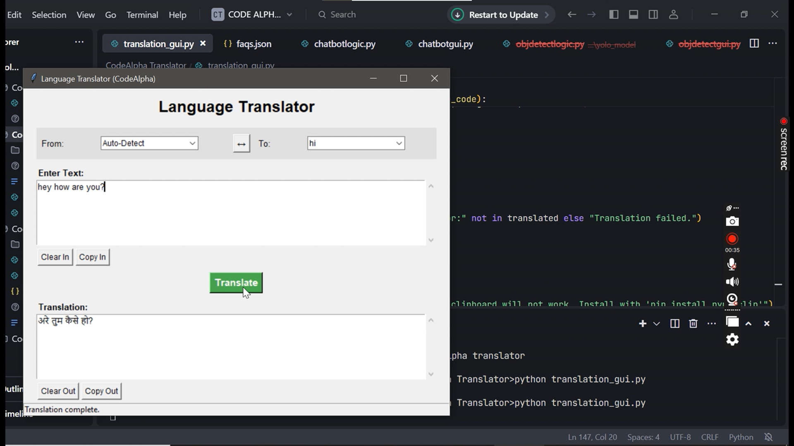

# CodeAlpha AI Internship - Completed Tasks

This repository contains the projects completed as part of the CodeAlpha AI Internship program. Each task is organized into its own subfolder.

## Projects Included:

### 1. [Language Translation Tool](./CodeAlpha_LanguageTranslator/)
A desktop application that translates text between multiple languages using the `deep_translator` library. Features include auto-detect, language swapping, and copy/clear functions.
*   **Screenshot:** 
     
    

### 2. [FAQ Chatbot](./CodeAlpha_FAQChatbot/)
A chatbot designed to answer Frequently Asked Questions about "AlphaProduct." It uses NLTK and Scikit-learn for NLP and similarity matching from a `faqs.json` knowledge base.
*   **Screenshot:** 
    
    

### 3. [Music Generation (Algorithmic/Markov Chain)](./CodeAlpha_MusicGenerationMarkov/)
A script that algorithmically generates a sequence of musical notes using a simple Markov Chain concept. It produces basic audible beeps on Windows.
*   **Console video in musicden folder** 
    
   

### 4. [Object Detection and Tracking](./CodeAlpha_ObjectDetectionTracking/)
An application for real-time object detection in images and webcam feeds using the YOLOv3 model.
*   **Screenshot:** 
    
    

## General Setup
Please refer to the individual `README.md` file within each project's subfolder for specific setup instructions and dependencies for that task. A consolidated `requirements.txt` covering common dependencies for all Python-based GUI tasks is provided in this root directory.

To install common dependencies (you might need others specified in sub-project READMEs):
```bash
pip install -r requirements.txt 
